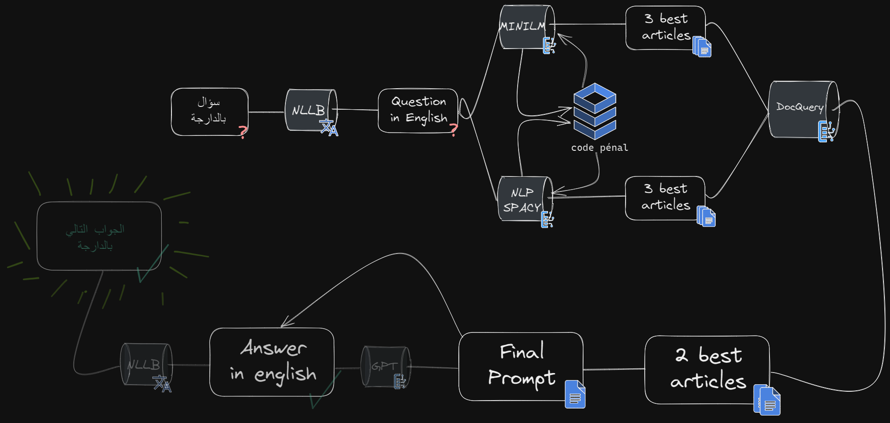

# Mustashari

## Table of Contents
- [About the project](#about-the-project)
- [Team](#team)
- [Usage](#usage)
- [Architecture](#architecture)
- [Technology Used and Credits](#technology-used-and-credits)

## About the project 
Mustashari is an app that enables Moroccans to access cheap legal consulting. Our goal is for Mustashari to be able to take questions in Moroccan Darija and give an appropiate answer based on the relevant articles from the Moroccan law. Right now Mustashari is able to understand text in Darija and pair it with the appropriate sections from the morrocan law. However, it doesn't generate satisfying answers because we currently lack access to a robust generative model API. It's now a prompt generator that can be used with a powerful AI like ChatGPT.

## Team
- [Ayyoub El Kasmi](https://www.linkedin.com/in/ayyoub-el-kasmi-727578236/)
- [Soufiane Ait El Aouad](https://www.linkedin.com/in/soufiane-ait-el-aouad/)
- [Marouane Amaadour](https://www.linkedin.com/in/marouane-amaadour-6ab824229/)

## Usage
To use Mustashari on your machine you can …
- Step 1: clone the repo
- Step 2: run the command "pip install -r requirements"
- Step 4: run the command "streamlit run streamlit _app.py"

Or you can just click on [this link](https://eniafou-mustashari-streamlit-app-rw5r56.streamlit.app/) to use it on the web.

You can also look throughs the notebooks to better understand how the code works.
## Architecture

## Difficulties and challenges
This was our first time working on a project about generative AI. We had to learn how to use APIs and combine multiple technologies from multiple sources to achieve a specific goal.
We had to learn about retrieval models, embedding, cosine similarity, Hugging Face, prompt engineering ...

In the begenning we wanted to use the OpenAI API to generate the final answers, but we soon learned that it wasn't free. We decided to work with **cohere** as an alternative, however we learned later on that it wasn't a robust model or at least we weren't able to find a good prompt to feed to it.

We tried multiple retrieval and embeddings models : **Chroma**, **CohereEmbedding**, **all-MiniLM-L12-v2**,**flaubert**, **spaCy**, **docquery**.
The results weren't good on our dataset of laws written in french. We tried some multilangual and french embedding models like : **distiluse-base-multilingual-cased-v1**,  **dangvantuan/sentence-camembert-large**, **dangvantuan/sentence-camembert-base**. However, we couldn't get better results.

We decided to translate the laws to english, we simply used google translate. The retrieval results using **all-MiniLM-L12-v2** with the translated laws were better, however due to the low quality of translation it is still not satisfactory. To solve this, we used two models (**all-MiniLM-L12-v2** + **spaCy**). The first one is a semantic model and the later one is a statistical model, each one of them retrieve 3 chunks of texts from the law. We then combined their results using **docquery**.

The app is still very slow and impractical and need more developpement?

## Technology used and Credits
- [No language left behind (Meta)](https://ai.facebook.com/research/no-language-left-behind/)
- [miniLM](https://huggingface.co/sentence-transformers/all-MiniLM-L6-v2)
- [spaCy](https://spacy.io/)
- [DocQuery](https://github.com/impira/docquery)
